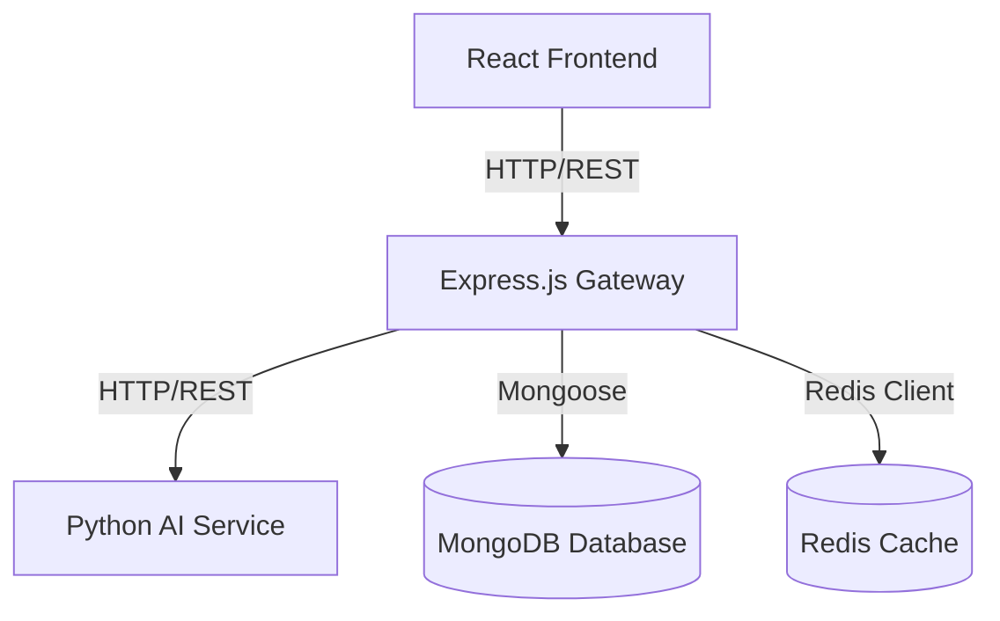
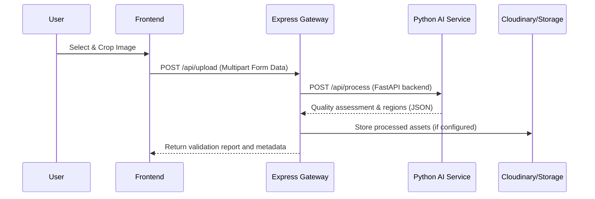

# SnapPass-AI Architecture & Developer Handbook

Welcome to the SnapPass-AI developer handbook. This document describes the system architecture, component interaction, and deployment model.

## System Topology

SnapPass-AI follows a decoupled three-tier microservice architecture:



### Components

1. **Frontend (React / Vite)**
   - Located in the `frontend` folder.
   - Responsible for UI rendering, cropping tools, print layouts, and interactive guides.
   - Built with Vanilla CSS/Tailwind, Framer Motion, and Lucide icons.

2. **Backend Gateway (Node.js / Express)**
   - Located in the `backend` folder.
   - Acts as the orchestrator: manages auth (JWT/cookie), file uploads, history records, and proxies requests to the Python AI service.

3. **Python AI Service (FastAPI / OpenCV)**
   - Located in the `python-ai-service` folder.
   - Houses the computer vision logic: blur assessment, face alignment, face bounding box validation, and high-DPI sheet assembly.

---

## Data & File Flows

### Passport Image Processing Lifecycle



## Running the Stack Locally

For development, run each service or use the root-level `docker-compose.yml`:

```bash
docker-compose up --build
```
