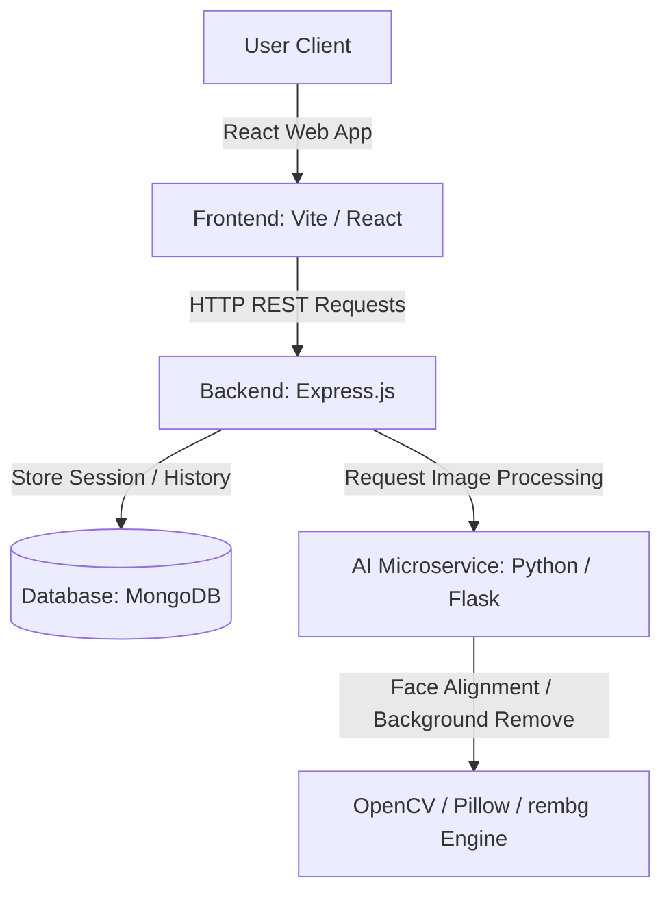

# SnapPass AI System Architecture

This document describes the design principles, service communication, and data flow of the **SnapPass AI** application.

## System Design Overview

SnapPass AI is structured as a decoupled 3-tier microservice architecture to ensure high performance, security, and scalability for heavy image processing pipelines.

---

## Component Responsibilities

### 1. Frontend (React / Vite)
- **Role**: Client UI & Presentation layer.
- **Technologies**: React 19, React Router, Vanilla CSS.
- **Responsibilities**:
  - Drag-and-drop file upload interfaces with client-side mime-type/size validations.
  - Interactive crop-and-preview workspace for custom background choices and sizing.
  - Session history storage using localStorage cache wrapper.
  - Theme switching and accessibility-compliant interaction flows.

### 2. Backend (Node.js / Express.js)
- **Role**: Core application router, API Gateway, and database manager.
- **Technologies**: Express, Mongoose, Multer, Winston, Helmet.
- **Responsibilities**:
  - Request rate limiting and CORS origin sanitation.
  - Storing and retrieving upload records and processing history metadata.
  - Relaying image array binaries to the Python processing pipeline.

### 3. AI Microservice (Python / Flask)
- **Role**: Computational engine optimized for computer vision.
- **Technologies**: Flask, OpenCV, Pillow, `rembg` (U2NET).
- **Responsibilities**:
  - Automatically isolates portrait background using neural nets (`rembg`).
  - Triggers OpenCV face detection cascades to center and align the human face.
  - Compresses DPI output properties to matching country standards.
  - Generates A4 sheet collage grids using Pillow coordinate calculations.

---

## API Request Lifecycle

### Upload & Processing Chain
1. User uploads a portrait in the React Client.
2. Client posts file binary to Express `POST /api/upload`.
3. Express stores it locally on the server under `/uploads` (or Cloudinary in production).
4. Client requests image modification specifying parameters to Express `POST /api/process`.
5. Express requests image sheet compilation from Flask service `POST /generate-sheet`.
6. Flask service performs face centering, background replacement, and A4 canvas layout.
7. Flask streams the final JPEG back to Express, which saves it and updates database states.
