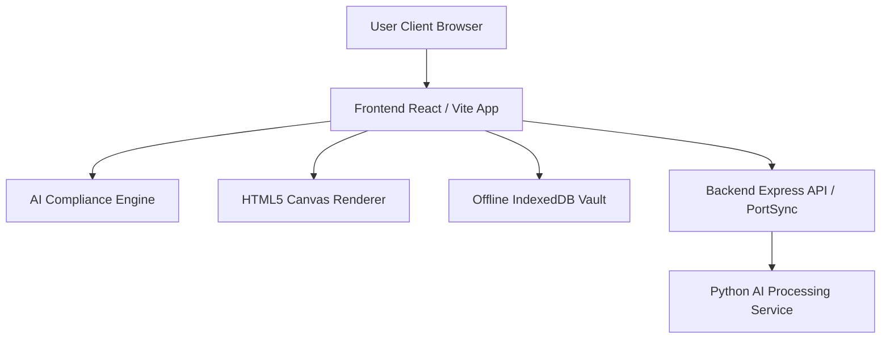

# SnapPass-AI System Architecture Guide

## Overview

SnapPass-AI is an end-to-end AI-powered passport photo verification, editing, and compliance processing engine.

```mermaid
graph TD
    A[User Client Browser] --> B[Frontend React / Vite App]
    B --> C[AI Compliance Engine]
    B --> D[HTML5 Canvas Renderer]
    B --> E[Offline IndexedDB Vault]
    B --> F[Backend Express API / PortSync]
    F --> G[Python AI Processing Service]
```

## Core Subsystems

### 1. AI Compliance Verification Engine
- Analyzes portrait proportions, background uniformity, eye alignment, and shadow distributions.
- Computes weighted quality scores against official country specifications (US, Schengen, India, UK).

### 2. Canvas & Image Processing Pipeline
- Real-time client-side image transformation, background removal overlay, attire fitting, and color histogram analysis.

### 3. Offline Resilience Vault
- Browser-native IndexedDB storage (`SnapPassOfflineVaultDB`) caching photo drafts, preset preferences, and queue items.

### 4. Custom Print Sheet Exporter
- Computes tile placement coordinate grids for multi-tile passport print sheets (4x6", A4, Letter).
