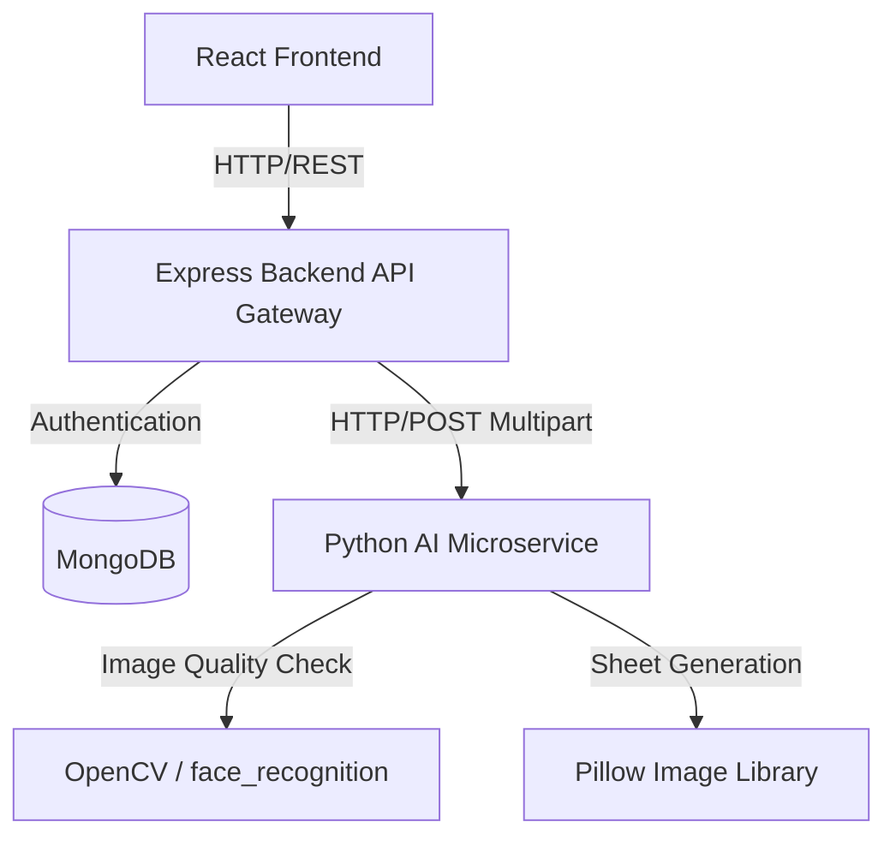

# Architecture and API Integration Guide

This document describes the high-level system architecture, component interaction, and detailed API documentation for SnapPass AI.

---

## 1. System Architecture Diagram



---

## 2. API Endpoint Specification

### Authentication API (Express Backend)

#### **Register User**
* **Endpoint:** `POST /api/v1/auth/register`
* **Request Body:**
  ```json
  {
    "fullName": "Jane Doe",
    "email": "jane@example.com",
    "password": "Password123!"
  }
  ```
* **Success Response (201 Created):**
  ```json
  {
    "success": true,
    "message": "User registered successfully",
    "data": {
      "id": "60d0fe4f5311236168a109ca",
      "fullName": "Jane Doe",
      "email": "jane@example.com",
      "role": "user"
    }
  }
  ```

#### **Login User**
* **Endpoint:** `POST /api/v1/auth/login`
* **Request Body:**
  ```json
  {
    "email": "jane@example.com",
    "password": "Password123!"
  }
  ```
* **Success Response (200 OK):**
  * Sets HTTP-only `token` cookie.
  * Body:
    ```json
    {
      "success": true,
      "message": "User logged in successfully",
      "data": {
        "id": "60d0fe4f5311236168a109ca",
        "fullName": "Jane Doe",
        "role": "user"
      }
    }
    ```

---

### Image Processing API (Express Gateway & Python AI Service)

#### **Process Image (Base Endpoint)**
* **Endpoint:** `POST /api/v1/process`
* **Headers:** `Content-Type: application/json`
* **Request Body:**
  ```json
  {
    "filename": "user_upload_123.jpg",
    "backgroundColour": "white",
    "photoSizePreset": "35x45"
  }
  ```
* **Gateway Flow:**
  1. Validates the filename structure against path traversal attacks.
  2. Ensures the local file exists and is not a symlink.
  3. Relays the file path to Python AI Service quality gate.
  4. If the quality gate checks pass, forwards the request to python-ai-service to remove the background and crop/resize.
  5. Streams the processed JPEG image back to the client.

#### **Face Quality Check (Python Microservice)**
* **Endpoint:** `POST /face-quality-check`
* **Request Body:**
  ```json
  {
    "file_path": "/uploads/user_upload_123.jpg"
  }
  ```
* **Response (200 OK):**
  ```json
  {
    "passed": true,
    "face_count": 1,
    "blur_score": 85.2,
    "rejection_code": null,
    "rejection_reason": null,
    "user_hint": null
  }
  ```

#### **Generate A4 Sheet (Python Microservice)**
* **Endpoint:** `POST /generate-sheet`
* **Request Body:**
  ```json
  {
    "photo_path": "/uploads/processed_user_upload_123.jpg",
    "preset_id": "35x45",
    "quantity": 8,
    "bg_color": [255, 255, 255],
    "draw_guides": true
  }
  ```
* **Response:** Streams raw A4 image file back. Cleans up the temporary generated file after request transmission completes.
