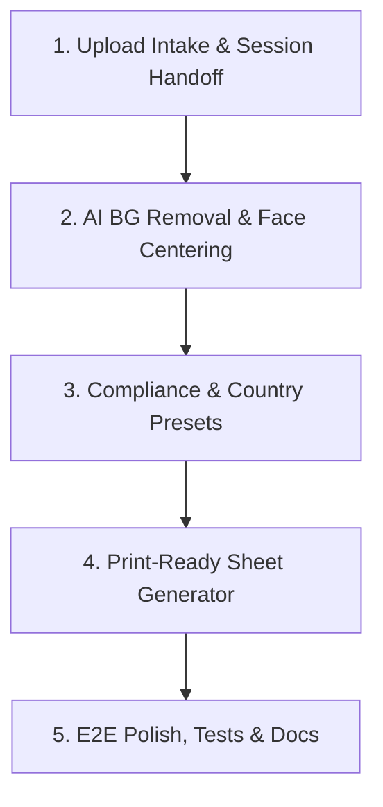

# SnapPass AI Photo Flow Workplan

This document outlines the implementation plan for automating the passport photo creation flow. It breaks down the entire selfie-to-passport lifecycle into 5 incremental, logically sequenced issues and Pull Requests (PRs). Each branch is to be created from the `master` branch.

---

## 📅 Roadmap Overview

---

## 🛠️ Detailed Issue & PR Breakdown

### Issue 1: Self-Serve Photo Upload & Session Handoff
- **Goal**: Implement robust frontend client-side validation and state management for user uploads.
- **Scope of Work**:
  - Add drag-and-drop & file selector inputs on the Upload Page.
  - Implement client-side validation for file size (max 10MB), formats (`JPEG`, `PNG`, `WEBP`), and aspect ratios.
  - Store selected image details in React Context / local session state.
  - Route user to the Editor Page with the loaded image.
- **Affected Components**:
  - `frontend/src/pages/UploadPage.jsx`
  - `frontend/src/components/UploadBox.jsx`
  - `frontend/src/context/`
- **Acceptance Criteria**:
  - Uploading a non-image file triggers an error toast.
  - Successfully uploaded image persists when navigating to the editor page.

---

### Issue 2: AI Background Removal & Face Centering Pipeline
- **Goal**: Integrate the Express backend with the Python Flask AI service to process uploaded portraits.
- **Scope of Work**:
  - Backend controller forwards images to the Python AI service.
  - Python AI service removes background using `rembg`.
  - Python AI service detects the face using OpenCV (`haar cascades` or DNN) and crops/centers the face with padding.
  - Return the processed preview as a clean data URL or temporary static link.
- **Affected Components**:
  - `backend/src/controllers/image.controller.js`
  - `python-ai-service/app/services/bg_remove.py`
  - `python-ai-service/app/services/face_center.py`
- **Acceptance Criteria**:
  - Processing endpoint returns a background-removed, face-centered version of the portrait.
  - Graceful error responses if no face is detected in the image.

---

### Issue 3: Passport Compliance & Country Presets
- **Goal**: Enforce standard visa/passport dimensions and visual guidelines.
- **Scope of Work**:
  - Define country preset standards (e.g., USA: 2x2 inches, India: 3.5x4.5 cm, Schengen: 3.5x4.5 cm).
  - Implement client-side crop overlays matching the selected country aspect ratio.
  - Add validation constraints on face percentage (e.g., face should occupy 70-80% of the height).
- **Affected Components**:
  - `frontend/src/pages/EditorPage.jsx`
  - `frontend/src/components/PhotoPreview.jsx`
- **Acceptance Criteria**:
  - Switching country dropdown adjusts crop boundaries and guides on screen.
  - Final crop complies exactly with target dimensions (DPI and aspect ratio).

---

### Issue 4: Print-Ready Sheet Generation
- **Goal**: Layout multiple passport photos onto printable paper formats (like A4 or 4x6).
- **Scope of Work**:
  - Implement an A4 sheet layout algorithm placing grid-aligned copies of the passport photo.
  - Include optional custom crop/cut lines and spacing borders between photos.
  - Create the print preview page with browser print options (`@media print` rules).
- **Affected Components**:
  - `frontend/src/pages/PrintPreviewPage.jsx`
  - `backend/src/controllers/print.controller.js`
- **Acceptance Criteria**:
  - Users can select the number of photos (e.g., 6, 8, 12, 16) to generate on sheet.
  - High-resolution print layout downloads correctly as PDF or triggers system print modal cleanly.

---

### Issue 5: End-to-End Flow Polish, Tests & Documentation
- **Goal**: Refine user transitions, add automated integration testing, and update documentation.
- **Scope of Work**:
  - Connect upload, processing, editing, and printing into a unified wizard UX.
  - Add integration tests verifying the full flow from uploading `dummy.jpg` to receiving a print sheet.
  - Complete the `docs/API.md` and update `README.md` to reflect the finished pipeline.
- **Affected Components**:
  - Entire repository (frontend, backend, documentation).
- **Acceptance Criteria**:
  - 100% functional flow from landing to printing without manual console interventions.
  - All automated validation tests pass successfully in CI/CD pipeline.
